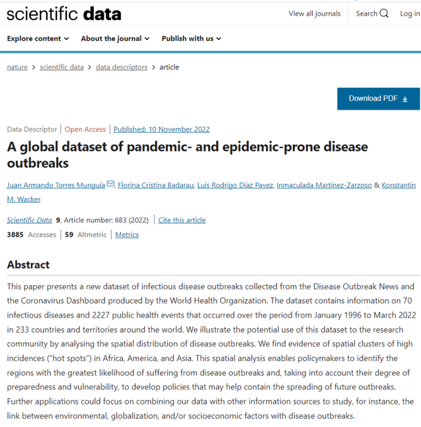

```{r setup, include = FALSE}
options(htmltools.dir.version = FALSE)
library(knitr)
library(tidyverse)
library(xaringanExtra)
library(qrcode)
#library(NHSRtheme)
#library(NHSRdatasets)
#library(icons)
# set default options
opts_chunk$set(echo=FALSE,
               collapse = TRUE,
               fig.width = 7.252,
               fig.height = 4,
               dpi = 300)

# set engines
knitr::knit_engines$set("markdown")

xaringanExtra::use_tile_view()
xaringanExtra::use_panelset()
xaringanExtra::use_clipboard()
xaringanExtra::use_webcam()
xaringanExtra::use_scribble()
xaringanExtra::use_broadcast()
xaringanExtra::use_share_again()
xaringanExtra::style_share_again(
  share_buttons = c("twitter", "linkedin", "pocket")
)

# uncomment the following lines if you want to use the NHS-R theme colours by default
# scale_fill_continuous <- partial(scale_fill_nhs, discrete = FALSE)
# scale_fill_discrete <- partial(scale_fill_nhs, discrete = TRUE)
# scale_colour_continuous <- partial(scale_colour_nhs, discrete = FALSE)
# scale_colour_discrete <- partial(scale_colour_nhs, discrete = TRUE)
```

class: title-slide, right, top
background-image: url(img/frame-art.png)
background-position: 75% 75%
background-size: cover

.right-column[
# `r rmarkdown::metadata$title`
### `r rmarkdown::metadata$subtitle`<br>

**`r rmarkdown::metadata$author`**<br>

`r rmarkdown::metadata$date`
]

???

---
class: top

# Acknowledgments

This dataset is the result of collaborative work by a team of researchers from the University of Göttingen (**Prof. Inmaculada Martínez-Zarzoso, Ph.D** and **M.Sc. Luis Díaz Pavez **), the University of Groningen (**Prof. Konstantin Wacker, Ph.D**), and the University of Bordeaux (**Prof. Florina Cristina Badarau, Ph.D **).

The project was made possible through financial support from the ENLIGHT network, the German Academic Exchange Service (DAAD), and the Federal Ministry of Education and Research (BMBF) in Germany.

---
class: top

# About this work
.pull-left[.center[]]

.pull-right[
**Torres Munguía, J.A., Badarau, F.C., Díaz Pavez, L.R. et al. A global dataset of pandemic- and epidemic-prone disease outbreaks. Sci Data 9, 683 (2022). https://doi.org/10.1038/s41597-022-01797-2**
]

---
name: question
class: inverse, middle, center

---
template: question

# `r fontawesome::fa("lightbulb", fill = "#FFFFFF", height = "2.05em", width = "2.05em")`
## From unstructured administrative records to an accessible, open, global dataset of pandemic- and epidemic-prone disease outbreaks

--

----

.left-col[.center[
`r fontawesome::fa("bacteria", fill = "#FFFFFF", height = "2em", width = "2em")`
### Need for data
]]

--

.center-col[
.center[
`r fontawesome::fa("laptop-code", fill = "#FFFFFF", height = "2em", width = "2em")`
### Process
]]

--

.right-col[.center[
`r fontawesome::fa("database", fill = "#FFFFFF", height = "2em", width = "2em")`
### Output
]]

---
class: top

# Need for data
The COVID-19 pandemic has widely demonstrated the hazard that infectious diseases can pose to global public health and development. According to the latest available estimates from the World Health Organization (WHO), as of 19 April 2023, it has been confirmed to have  caused more than 6.9 million deaths. 

In 2019, infectious diseases claimed more than 5.1 million lives, accounting for 14% of the 55.4 million deaths worldwide.

In the last two decades leading up to the COVID-19 pandemic, the world has witnessed how disease outbreaks are emerging at unprecedented rates:

- Severe acute respiratory syndrome associated Coronavirus (SARS-CoV) in 2003, 
- Influenza A(H1N1) pandemic during 2009-2010, 
- Middle East respiratory syndrome Coronavirus (MERS-CoV) outbreak in 2012, 
- Ebola virus disease epidemic during 2013-2016, 
- zika virus epidemic during 2015-2016.

???
However, COVID-19 is not the only infectious disease threatening the world.  

According to the latest available estimates from the World Health Organization (WHO), as of 19 April 2023 it has been confirmed to have affected over 763.7 million people worldwide, having caused more than 6.9 million deaths. 

---
class: top

# Need for data
Unfortunately, existing data on the matter:

- Exclusively cover a limited number of infectious diseases, 
- are specific to a population, country, or region, or 
- are based on unofficial information, which may contain incorrect information or disinformation from false reports, 
- or are not publicly available, hampering their reuse and utilization.

---
template: question

# `r fontawesome::fa("arrow-up-right-dots", fill = "#FFFFFF", height = "2.05em", width = "2.05em")`
## *"If you can't measure it, you can't manage it."*

---
class: top

# Process
#### Disease Outbreak News (DONs) 
.pull-left[.center[]]

.pull-right[.center[]]

???
The information of the DONs is obtained from an integrated global system coordinated by the WHO. This information is based on epidemiological, clinical, and laboratory investigations conducted by the official public health authorities, institutions, and research networks of the WHO and its partners all over the world.

---
class: top

# Process
#### Code 

--

.pull-left-narrow[
.center[`r fontawesome::fa("code", fill = "#153268", height = "2.25em", width = "2.25em")`]]
.pull-right-wide[
- **Web scraping information from www.who.int**
- **2721 DONs collected**
]

--

.pull-left-narrow[
.center[`r fontawesome::fa("r-project", fill = "#153268", height = "2.25em", width = "2.25em")`]]
.pull-right-wide[
- **Data and text mining using R (remove duplicates, subset only diseases)**
]

???

---
template: question

# `r fontawesome::fa("wand-magic-sparkles", fill = "#FFFFFF", height = "2.05em", width = "2.05em")`
## After more than 3000 lines of code...

--

## and some manual imputation.

---
class: top

# Output

#### The final dataset contains information on 2227 disease outbreaks and provides six key advantages in comparison to existing data:

--

.pull-left-narrow[
.center[`r fontawesome::fa("chart-line", fill = "#153268", height = "2em", width = "2.25em")`]]
.pull-right-wide[
** a) Information from January 1996.**
]

--

.pull-left-narrow[
.center[`r fontawesome::fa("globe", fill = "#153268", height = "2em", width = "2.25em")`]]
.pull-right-wide[
** b) A wide geographic coverage of 233 countries and territories around the world.**
]

--

.pull-left-narrow[
.center[`r fontawesome::fa("disease", fill = "#153268", height = "2em", width = "2.25em")`]]
.pull-right-wide[
** c) An extensive coverage of 70 infection diseases.**
]

--

.pull-left-narrow[
.center[`r fontawesome::fa("code-merge", fill = "#153268", height = "2em", width = "2.25em")`]]
.pull-right-wide[
** d) Standardized concepts and definitions: official country names according to the ISO-316623 and the ICD-10**
]

---
class: top
# Output

#### The final dataset contains information on 2227 disease outbreaks and provides six key advantages in comparison to existing data:

--

.pull-left-narrow[
.center[`r fontawesome::fa("magnifying-glass", fill = "#153268", height = "2em", width = "2.25em")`]]
.pull-right-wide[
** e) FAIR (Findability, Accessibility, Interoperability, and Reusability) guiding principles for scientific data management.**
]

--

.pull-left-narrow[
.center[`r fontawesome::fa("cloud-arrow-down", fill = "#153268", height = "2em", width = "2.25em")`]]
.pull-right-wide[
** f) For transparency, replicability, and reproducibility purposes, we make the data, metadata, and the code to create these data publicly available from Figshare.**
]

---
template: question

# `r fontawesome::fa("users", fill = "#FFFFFF", height = "2.05em", width = "2.05em")`
## Uses and applications

---
class: top
# Uses and applications

--
.pull-left[
- **To identify countries having significantly higher incidence.**

- **To identify temporal patterns.**
]
.pull-right[
- **Correlates of outbreaks.**

- **Differences among diseases.**
]

---
class: top
# Dashboard

.center[[](https://jatorresmunguia.shinyapps.io/A_global_dataset_of_disease_outbreaks/) <br> 
**Scan me!** <br> 
**or go to: https://s.gwdg.de/hqj0NV**
]

---
class: goodbye-slide, inverse, middle, left

# Thank you very much!

.pull-right[

.right[
### Contact information
[`r fontawesome::fa("twitter", a11y = "sem")` @jtorresmunguia ](https://twitter.com/jtorresmunguia) <br/>
[`r fontawesome::fa("at", a11y = "sem")` jtorres@gwdg.de ](jtorres@gwdg.de) <br/>
[`r fontawesome::fa("file-contract", a11y = "sem")` Read the paper ](https://www.nature.com/articles/s41597-022-01797-2) <br/>
[`r fontawesome::fa("cloud-arrow-down", a11y = "sem")` Access to data from Figshare ](https://doi.org/10.6084/m9.figshare.17207183.v2) <br/>
[`r fontawesome::fa("chart-line", a11y = "sem")` Link to dashboard ](https://jatorresmunguia.shinyapps.io/A_global_dataset_of_disease_outbreaks/) <br/>
[`r fontawesome::fa("person-chalkboard", a11y = "sem")` Slides ](https://jatorresmunguia.github.io/A_global_dataset_of_disease_outbreaks_SA_presentation_0324/#30)

]
]


